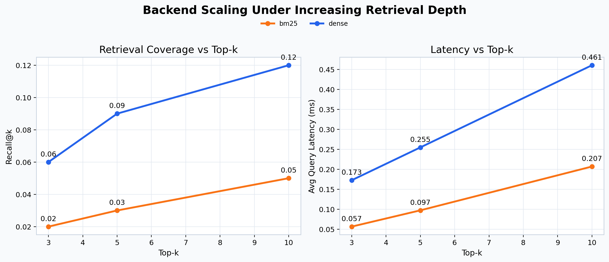
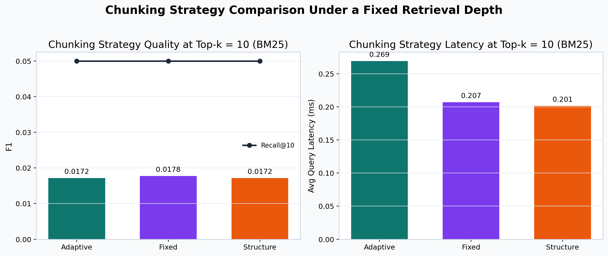
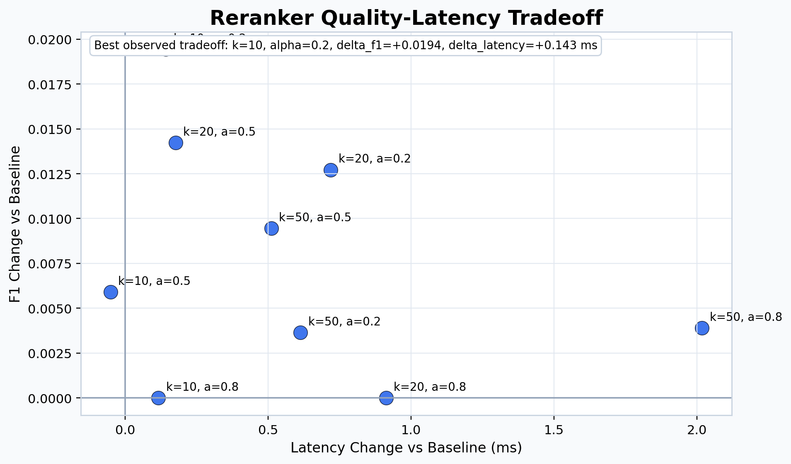

# ECE1508 RAG Chunking Study

## 1) Project Purpose
This project provides a reproducible Retrieval-Augmented Generation (RAG) experiment framework to evaluate how chunking strategy impacts retrieval quality and downstream QA quality in a frozen-model setup.

Primary study question:
- when retriever and generator models are fixed, which chunking strategy yields the best retrieval and answer quality tradeoff?

## 2) Environment Setup
Requirements:
- Python `3.10+` (recommended `3.10` or `3.11`)
- Windows/macOS/Linux
- CPU is sufficient for portable interactive mode
- GPU is recommended for larger dense/generation runs

Setup:
```bash
python -m venv .venv
.venv\Scripts\activate
pip install -r requirements.txt
```

## 3) Quick Start
### A) Portable Interactive Mode (fastest)
Runs directly on bundled demo corpus. No dataset download and no index prebuild required.

```bash
python scripts/setup_portable.py --open
```

Open:
- `http://127.0.0.1:8000/dashboard/`
- `http://127.0.0.1:8000/dashboard/demo.html`

Notes:
- the dashboard overview loads the complete stored experiment results automatically
- the live demo is a lightweight local interface for retrieval inspection on the bundled demo corpus
- portable mode is optimized for low-friction presentation rather than full research control

### B) Full Experiment Mode (lite baseline recommended)
```bash
python scripts/setup_full.py
```

Optional:
```bash
python scripts/setup_full.py --run-qa
python scripts/setup_full.py --serve --open
```

## 4) Configuration Files
- `configs/portable_interactive.yaml`: lightweight BM25 interactive mode with bundled local demo corpus and simplified dashboard/demo presentation
- `configs/baseline_lite.yaml`: recommended reproducibility baseline
- `configs/baseline_lite_bm25_only.yaml`: BM25-only matrix on lite corpus
- `configs/baseline_lite_reranker.yaml`: lite matrix with reranker enabled
- `configs/reranker_ablation_lite.yaml`: reranker ablation grid (`candidate_k`, `alpha`)
- `configs/baseline_dense.yaml`: heavier dense setting for extended runs
- `configs/baseline_bm25.yaml`: BM25 baseline on full setting

## 5) Project Value
This repository can be used as:
- a research framework for chunking strategy comparison
- a benchmark template for Dense vs BM25 retrieval baselines
- an engineering reference for end-to-end RAG evaluation workflows

It provides:
- standardized configurations for fair comparison
- consistent output protocol for reproducibility
- unified metrics for quality and efficiency analysis

## 6) Project Results
The framework produces structured and reproducible outputs for each run, including:
- QA metrics: `EM`, `F1`
- retrieval metrics: `Recall@k`, `MRR`
- efficiency metrics: retrieval latency and total latency
- detailed prediction/evidence artifacts for error analysis

It also supports matrix studies and reranker ablation analysis to produce comparison tables, summaries, and plots.

Current lite-run highlights from repository artifacts:
- Dense baseline (`fixed`, chunk size `128`, overlap `0`, `top_k=10`) reached `Recall@10 = 0.12` and `MRR = 0.0427`.
- Increasing `top_k` from `3 -> 5 -> 10` improved recall (`0.06 -> 0.09 -> 0.12`) and MRR (`0.0317 -> 0.0387 -> 0.0427`) with latency increase (`0.176 ms -> 0.258 ms -> 0.489 ms`).
- Best reranker quality gain in the lite ablation was at `candidate_k=10`, `alpha=0.20`, with `delta_f1=+0.0194` and `delta_latency=+0.143 ms`.

## 7) Visualization and Interactive Demo
This project includes built-in visualization and interactive inspection:
- dashboard overview: `/dashboard/` for an automatic full-results overview
- live QA console: `/dashboard/demo.html` for a simplified local QA demo
- plotting/report scripts: `scripts/plot_results.py`, `scripts/plot_sensitivity.py`, `scripts/build_final_report.py`

Dashboard behavior:
- `/dashboard/` automatically loads and presents the complete experiment matrix without manual parameter selection
- `/dashboard/demo.html` is intentionally simplified for presentation and focuses on lightweight BM25-based local interaction

### Visualization Preview
#### Backend Scaling


#### Chunking Strategy Comparison


#### Reranker Tradeoff


### What the charts indicate
- **Backend scaling:** Dense retrieval consistently achieves higher recall than BM25 as `top_k` increases, but it also incurs higher latency. This captures the central quality-efficiency tradeoff in the pipeline.
- **Chunking strategy comparison:** in the lite BM25 matrix at `top_k=10`, the three chunking strategies produce similar retrieval quality, but they differ in `F1` and latency, showing that chunking still matters even when the backend is fixed.
- **Reranker tradeoff:** the reranker does not produce uniform gains. The best lite setting (`candidate_k=10`, `alpha=0.20`) improves `F1` while adding only a modest latency increase, which makes the tradeoff interpretable rather than purely anecdotal.

## 8) Why This Fits Applied Deep Learning
This project aligns with an Applied Deep Learning course because it applies pretrained deep models in a real evaluation workflow and analyzes practical design tradeoffs:
- uses foundation models directly in an application pipeline (`e5-base-v2`, `flan-t5`)
- studies model behavior under system-level design choices (chunking, top-k, reranking) rather than training-only metrics
- evaluates with deployment-relevant criteria: answer quality, retrieval ranking quality, and latency
- includes reproducibility, ablation, and visualization, which are core expectations for applied ML engineering

The focus is on **applied model utilization and decision-making**, which is central to Applied Deep Learning projects.

## 9) Implemented Scope
- Dense retrieval: `intfloat/e5-base-v2` + FAISS (`IndexFlatIP`)
- Sparse baseline: BM25 (`rank-bm25`)
- Generator: `google/flan-t5-base` (fallback: `google/flan-t5-small`)
- Chunking strategies: `fixed`, `structure`, `adaptive`
- Metrics: `EM`, `F1`, `Recall@k`, `MRR`, latency
- Frontend: dashboard + interactive demo

Out of scope:
- model training, fine-tuning, distillation
- production deployment and distributed serving

### Current Status
- the end-to-end experimental pipeline is implemented: data preparation, chunking, indexing, retrieval, generation, and evaluation
- reproducible experiment scripts are available for baseline runs, matrix studies, and reranker ablation
- the repository includes a simplified dashboard for presenting stored experiment results and a lightweight local QA demo for live retrieval inspection
- the current portable demo mode is intentionally limited to a lightweight BM25 configuration for low-friction presentation
- full dense retrieval, multi-strategy comparison, and QA evaluation remain available through the experiment scripts and non-portable configs

### Limitations
- the portable interactive demo is not a full research control panel; it is simplified for presentation and does not expose the complete experiment matrix
- the dashboard overview shows summarized experiment results rather than every raw run as a separate interactive visualization
- reported scores in the repository are primarily based on lite-scale runs, so they should be interpreted as controlled course-project results rather than large-scale benchmark claims
- retrieval and QA quality are constrained by frozen pretrained models; the project does not study whether fine-tuning could change the relative ranking of chunking strategies
- dense retrieval and generation depend on local model downloads and available hardware, which makes the full pipeline heavier than the portable demo path
- some local test environments, especially on Windows, may require an explicit writable `pytest --basetemp` directory because temporary-directory permissions can interfere with test execution

## 10) Repository Structure
```text
ECE1508-RAG-Chunking-Study/
|- configs/                 # experiment YAML configs
|- dashboard/               # frontend dashboard and interactive demo
|- data/
|  |- demo/                 # bundled lightweight demo corpus
|  |- processed/            # generated prepared corpus/query files (gitignored)
|  |- indexes/              # generated index and chunk artifacts (gitignored)
|- results/                 # generated run outputs and analysis (gitignored except .gitkeep)
|- scripts/                 # executable experiment/evaluation scripts
|- src/                     # core implementation
|- tests/                   # unit and smoke tests
|- requirements.txt
|- README.md
```

Additional structure notes: `docs/PROJECT_STRUCTURE.md`

## 11) Main Commands
### Data and Index
```bash
python scripts/prepare_data.py --config <config_path>
python scripts/build_index.py --config <config_path> [--force-rebuild]
```

### Evaluation
```bash
python scripts/run_retrieval_eval.py --config <config_path> [--force-rebuild]
python scripts/run_qa_eval.py --config <config_path> [--force-rebuild]
```

### Matrix Experiments
```bash
python scripts/run_experiments.py --config <config_path> [--limit N] [--skip-qa] [--force-rebuild]
```

Reranker-focused runs:
```bash
python scripts/run_experiments.py --config configs/baseline_lite_reranker.yaml
python scripts/run_experiments.py --config configs/reranker_ablation_lite.yaml
python scripts/analyze_reranker_ablation.py --matrix-summary results/reranker_ablation_lite_matrix_summary.json
```

### Reporting and Visualization
```bash
python scripts/build_final_report.py [--results-dir results] [--out-dir results/analysis]
python scripts/plot_sensitivity.py --matrix-summary <summary_json_or_list...> [--out-dir results/analysis/sensitivity]
python scripts/build_readme_figures.py
python scripts/organize_results.py
```

Example:
```bash
python scripts/plot_sensitivity.py --matrix-summary results/baseline_lite_matrix_summary.json results/baseline_lite_reranker_matrix_summary.json
```

### API Smoke Test
```bash
pytest -q tests/test_api_smoke.py
```

## 12) Output Contract
Each run writes:
- `results/{exp_name}/metrics.json`
- `results/{exp_name}/predictions.jsonl`
- `results/{exp_name}/retrieval_hits.jsonl`
- `results/{exp_name}/error_analysis.md`
- `results/{exp_name}/run_manifest.json`

Matrix suite runs also write:
- `results/{base_exp_name}_run_manifest.json`

Index/chunk artifacts are stored under:
- `data/indexes/{index_name}/...`

## 13) Reproducibility Checklist (Recommended Final Run)
```bash
python scripts/prepare_data.py --config configs/baseline_lite.yaml
python scripts/build_index.py --config configs/baseline_lite.yaml
python scripts/run_retrieval_eval.py --config configs/baseline_lite.yaml
python scripts/run_qa_eval.py --config configs/baseline_lite.yaml
python scripts/run_experiments.py --config configs/reranker_ablation_lite.yaml
python scripts/analyze_reranker_ablation.py --matrix-summary results/reranker_ablation_lite_matrix_summary.json
```

## 14) What Is Tracked in Git
Included in clone:
- source code (`src/`, `scripts/`, `dashboard/`, `tests/`)
- configs (`configs/`)
- demo corpus (`data/demo/corpus.jsonl`, `data/demo/queries.jsonl`)

Generated locally (not tracked):
- `data/processed/*`
- `data/indexes/*`
- `results/*` (except `results/.gitkeep`)

## 15) Troubleshooting
- `ModuleNotFoundError: No module named 'yaml'`
  - run `pip install -r requirements.txt`

- Hugging Face downloads are slow or rate-limited
  - run `hf auth login`
  - or set `HF_TOKEN`

- Cache fills `C:` drive
  - move Hugging Face cache to `D:`:
  ```powershell
  [Environment]::SetEnvironmentVariable("HF_HOME", "D:\\hf_home", "User")
  [Environment]::SetEnvironmentVariable("TRANSFORMERS_CACHE", $null, "User")
  ```

- `Repo id ... ''` during QA eval
  - ensure `generator.model_name` is set in config

- `pytest` temp directory permission issue (`WinError 5`)
  - use a writable temp directory or set a writable `--basetemp`
